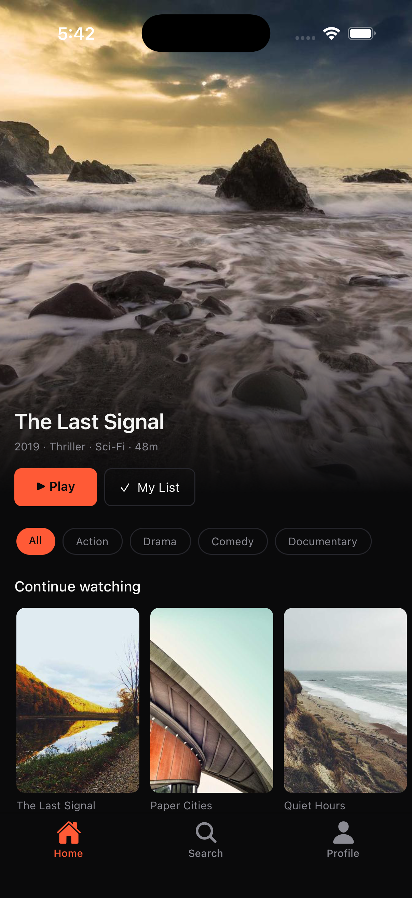
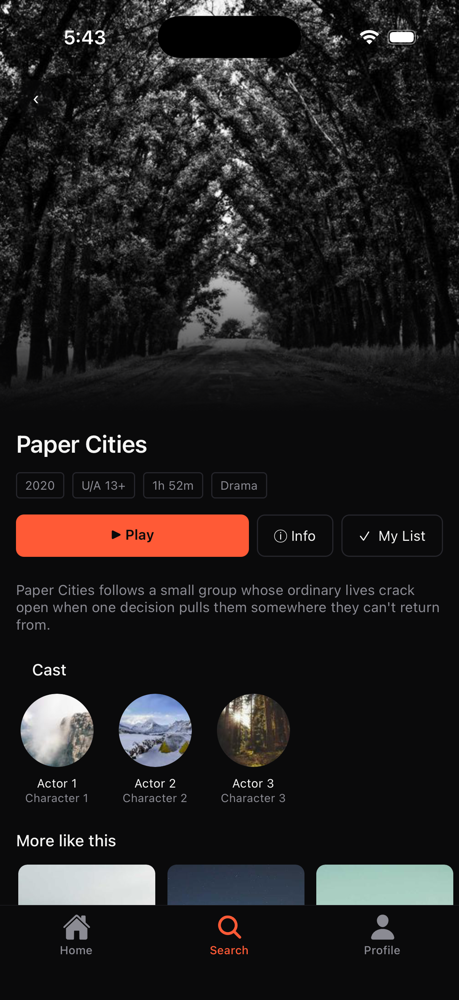
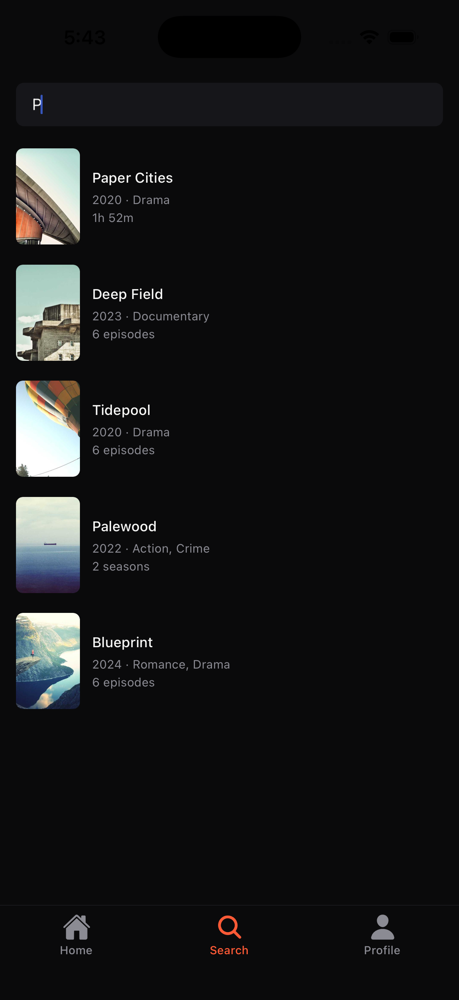
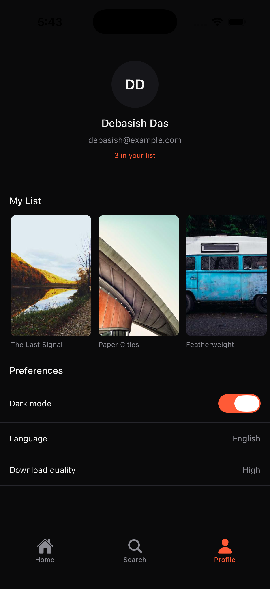
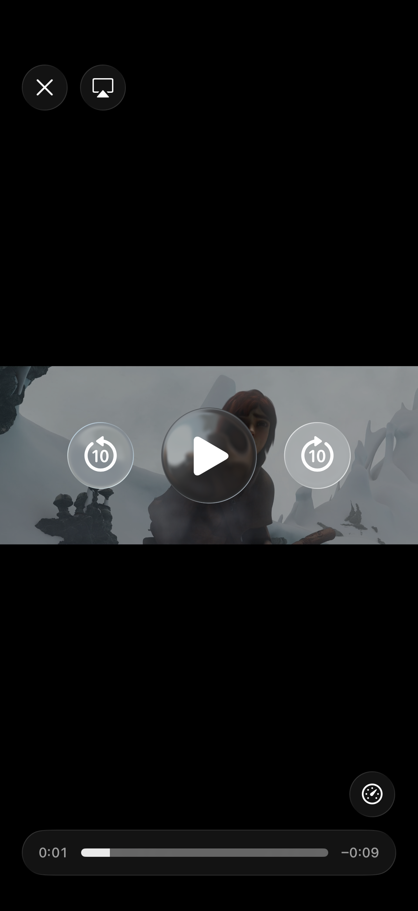

# HOE Streaming — React Native (Expo) UI Clone

A high-fidelity, production-style streaming app inspired by **Disney+ Hotstar**,
built with Expo and TypeScript. It features a content-rich home feed, a rich
detail view with a scroll-driven animated header, search with infinite scroll, a
profile with a working watchlist, video playback, and a WebView integration.

> Built for the House of Edtech React Native (Expo) Advanced UI Clone assignment.

---

## Demo

<!-- Replace these with your own screenshots / recording -->

| Home                            | Detail                              | Search                              |
| ------------------------------- | ----------------------------------- | ----------------------------------- |
|  |  |  |

| Profile                               | Player                              |
| ------------------------------------- | ----------------------------------- |
|  |  |

**Video walkthrough:** _link to your recorded demo_
**Expo Go / APK:** _your shareable Expo link or APK download_

---

## Tech Stack

| Concern           | Choice                                        |
| ----------------- | --------------------------------------------- |
| Framework         | Expo (Managed Workflow, SDK 57)               |
| Language          | TypeScript (strict mode)                      |
| Styling           | NativeWind v5 (Tailwind for React Native)     |
| Navigation        | React Navigation (Bottom Tabs + Native Stack) |
| Component Library | React Native Paper                            |
| Server state      | TanStack React Query                          |
| Client state      | Zustand                                       |
| Media / images    | expo-video, expo-image, expo-linear-gradient  |

---

## Getting Started

### Prerequisites

- **Node.js 18+** (developed on Node 22)
- **Expo Go** app on your phone, or an iOS Simulator / Android Emulator
- npm (bundled with Node)

### Setup

```bash
# 1. Clone the repo
git clone https://github.com/dasdeveloperdebasish/hoe-streaming
cd hoe-streaming

# 2. Install dependencies
npm install

# 3. (Optional) regenerate the mock dataset
npm run generate:content

# 4. Start the dev server
npx expo start --clear
```

Then:

- **Phone:** scan the QR code with Expo Go.
- **iOS Simulator:** press `i` in the terminal.
- **Android Emulator:** press `a`.

If styles or config changes don't appear, restart with `npx expo start --clear`
to clear the Metro cache.

---

## Features

**Navigation**

- Bottom tab navigation (Home, Search, Profile)
- Native stack per tab, so Detail pushes over the tab and the tab bar stays visible
- Safe-area handling on both platforms

**Home**

- Immersive hero banner with a gradient scrim for readable overlay text
- Horizontal carousels (Continue Watching, Trending, New Releases)
- Category chips that filter the feed by genre
- Pull-to-refresh

**Detail**

- Scroll-driven animated header (fades on scroll, native-thread driven)
- Rich metadata: genre / rating / year / duration tags
- Cast row and a "More like this" carousel
- Unified single-scroll layout
- Play, My List (watchlist), and Info (WebView) actions

**Search**

- Live search by title or genre
- Infinite-scroll pagination
- Empty-query, no-results, and results states

**Profile**

- User header with a live watchlist count
- "My List" of saved shows (tappable, opens Detail)
- Dark-mode toggle and preference rows

**Video Player**

- Per-show video playback (data-driven URLs)
- Native controls, fullscreen, and landscape orientation

**WebView**

- `react-native-webview` with a two-way `postMessage` bridge
- Injected JS reports the page title and intercepts link taps

**State completeness**

- Skeleton loaders, error states with retry, and empty states throughout

---

## Architecture Overview

The app is built in clean layers so each part can change without breaking the others.

```
src/
├── components/
│   ├── ui/          Reusable presentational components (Poster, Carousel, Chip, Tag, HeroBanner, ...)
│   └── feedback/    Skeletons, ErrorState, EmptyState
├── constants/       theme.ts (colours/sizes), strings.ts (all UI text)
├── data/            Mock dataset (content.ts) and home feed (feed.ts)
├── hooks/           React Query hooks (useHomeFeed, useContentDetail, useSearch)
├── navigation/      Tab + stack navigators and typed param lists
├── screens/         Home, Detail, Search, Profile, Player, Web
├── services/        api.ts — the mock API / service layer
├── store/           Zustand stores (theme, watchlist)
└── types/           Shared TypeScript interfaces
```

### Data flow: screen → hook → service

Screens never fetch directly. A screen calls a hook (`useHomeFeed`), the hook calls
the service (`api.ts`), and the service resolves mock JSON. The screen only renders;
the hook owns caching/loading/error via React Query; the service owns the data
source. Swapping the mock for a real REST API means editing **one file** — screens
and hooks stay untouched.

### Mock API / service layer

`services/api.ts` mimics a real backend: every function returns a `Promise`, adds an
artificial delay (so loading skeletons are visible), and fails randomly ~8% of the
time (so the error state is genuinely reachable). This satisfies the "asynchronous
mock service with artificial delays" requirement while keeping the code fully
data-driven.

### State management

- **Server state → React Query.** Caching, loading, error, and retry are handled
  for free. Each show is cached by `["content", id]`, so revisiting is instant.
- **Client state → Zustand.** Only theme and watchlist are truly global. Each store
  is ~10 lines with no provider/boilerplate — Redux would have been overkill for
  two small pieces of state.

### Component library choice: React Native Paper

Paper is used for standard form controls (the Profile switch and the Player's
fullscreen button), themed to match the custom dark palette. Streaming-specific UI
(posters, carousels, hero) is built with custom NativeWind components, where a
distinct visual identity matters more than a library default. The split is
deliberate: Paper for standard controls, custom for domain UI.

### Styling & design tokens

Colours and sizes are centralized. NativeWind reads them from `global.css`
(`@theme`) for `className` styling; a mirrored `COLORS` object in
`constants/theme.ts` feeds inline styles and JS values (tab tint, gradients, Paper
theme). One source of truth for the palette.

---

## Performance

- FlatLists tuned with `initialNumToRender`, `windowSize`, `removeClippedSubviews`,
  and stable `keyExtractor`s.
- `React.memo` on card components; `useCallback` on `renderItem`/`keyExtractor` so
  the memoization actually holds.
- `useMemo` for the filtered section list (recomputed only on data/category change).
- `expo-image` with blurhash placeholders and fade transitions.
- Scroll and header animations use `useNativeDriver: true` (native thread, 60fps).

---

## Notable Engineering Decisions

- **NativeWind v5 over v4** — required for Expo SDK 57's New Architecture (v4's Babel
  JSX transform breaks there).
- **Built-in Animated over Reanimated** — Reanimated needed extra New-Architecture
  config; RN's `Animated` with `useNativeDriver` gives the same 60fps result with
  no dependency risk.
- **Per-tab stacks** — Home, Search, and Profile each own a stack so Detail (and
  Player/WebContent) are reachable from any tab with the tab bar intact.
- **Centralized UI strings** — no hardcoded text in screens; one file, ready for
  future localization.

A deeper decision log lives in [`NOTES.md`](./NOTES.md).

---

## Bonus Objectives

- ✅ Micro-interactions (animated header, shimmer skeletons)
- ✅ Pull-to-refresh
- ✅ Infinite-scroll pagination
- ✅ Theme toggle wired to the color-scheme system (dark-first; full light palette
  is a documented next step)
- ⬜ Jest tests (skipped to keep the core polished within the deadline)

---

## Scripts

| Command                    | Description                      |
| -------------------------- | -------------------------------- |
| `npx expo start`           | Start the dev server             |
| `npx expo start --clear`   | Start with a cleared Metro cache |
| `npm run generate:content` | Regenerate the mock dataset      |
| `npx expo lint`            | Run ESLint                       |

---

## Future Improvements

- Full light theme across all screens (tokens already centralized)
- Debounced search
- Real content via TMDB (keeping the mock service as a fallback)
- Component tests with Jest + React Native Testing Library
- Push notifications with deep links into Detail
